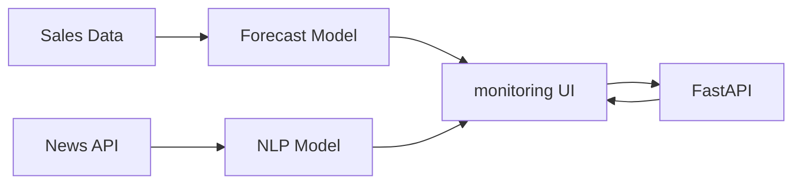
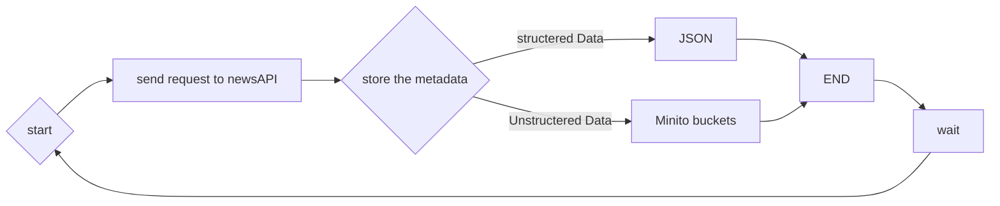

# MLOps Project

This project implements an MLOps pipeline for retail news analytics. It includes:
- **News Data Collection:** Fetches news articles via NewsAPI.
- **Data Transformation & Storage:** Processes and stores articles and images into a data lake using MinIO.
- **Airflow DAGs:** Orchestrates the data pipeline for periodic collection and processing.
- **Testing:** Automated tests under the `tests/` directory.

## Project Structure
- `/Mlops/airflow`: Airflow configuration (DAGs, config files).
- `/Mlops/NewsDataCollector.py`: Module to fetch and process news articles.
- `/Mlops/tests`: Contains test scripts, e.g. `news_tester.py`.
- `/Mlops/README.md`: Project documentation.

## Technical architectures: 
### system workflow :

##### News Scrapper


## Setup and Usage
1. **Environment Variables:**
   #### newsAPI
   - create your API key from https://newsapi.org/
   #### Minio server
   ```bash
   $ cd minio
   $ wget https://dl.min.io/server/minio/release/linux-amd64/minio
   $ chmod +x minio
   $ ./minio server raws
   ```

    #### apache-airflow:
   ```bash
   $ pip install apache-airflow
   $ airflow db init
   $ airflow users create \
    --username admin \
    --firstname First \
    --lastname Last \
    --role Admin \
    --email admin@example.com \
    --password admin
   $ airflow scheduler
   $ airflow webserver --port 8080# run it in other terminal  
   
   ```
   
3. **Running Airflow:**  
   Initialize and run Airflow to schedule the DAGs.
4. **Testing:**  
   Run test scripts in `/Mlops/tests` to validate functionalities.

## Requirements
```bash
python -m venv myenv 
source myenv/bin/activate
pip install -r requirements.txt

```


