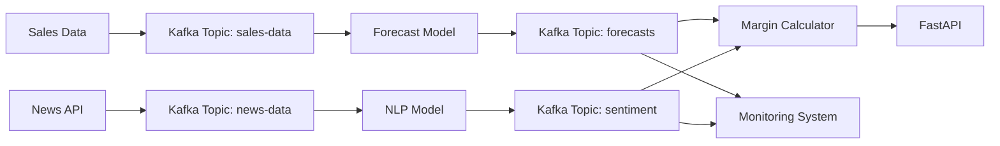

**1. Core Objectives**:  
- Predict **product demand** (units needed) based on historical sales, seasonality, and external factors.  
- Estimate **profit margins** by combining demand forecasts with cost/pricing data.  
- Integrate **news sentiment analysis** (NLP) to capture trends (e.g., viral products, supply chain disruptions).  

**2. Tech Stack**:  
- **Data/ML**: Python (Prophet/SARIMA for time-series), Hugging Face (NLP for news), Scikit-learn (margin models).  
- **MLOps**: MLflow (experiment tracking), Prefect/Airflow (orchestration), Evidently (monitoring).  
- **Deployment**: FastAPI (REST API), Docker, AWS SageMaker/GCP Vertex AI.  
- **Frontend**: Streamlit (for internal dashboards) *optional*.  

**3. Data Requirements**:  
- **Structured Data**: Historical sales (date, product ID, units sold, cost, price).  
  *(Example: [Walmart Dataset](https://www.kaggle.com/c/walmart-recruiting-store-sales-forecasting/data))*  
- **Unstructured Data**: News headlines/articles (e.g., from [NewsAPI](https://newsapi.org/)).  

**4. Key Features**:  
- **Time-Series Forecasting**: Handle seasonality (e.g., holidays) and trends.  
- **NLP Pipeline**: Extract sentiment/events from news (e.g., "shipment delays in China" → lower supply).  
- **Profit Modeling**:  
  ```python  
  margin = (predicted_demand * price) - (predicted_demand * cost)  
  ```  
- **Automated Retraining**: Trigger updates when new sales data/news arrives.  

**5. Deliverables**:  
- **Step-by-Step Roadmap**: From data collection to deployment.  
- **Code Snippets**:  
  - SARIMA/Prophet training pipeline.  
  - Hugging Face sentiment analysis integration.  
  - FastAPI endpoint for predictions.  
- **Architecture Diagram**: Data flow from news APIs → NLP → forecasting → margin calculation.  
- **Monitoring Setup**: Alerts for demand drift (Evidently) or news sentiment spikes.  

**6. Stretch Goals**:  
- Add **computer vision** for shelf-stock analysis (if image data exists).  
- **LLM-enhanced explanations** (e.g., "Demand dropped due to negative news about Product X").  


---

### **What You’ll Get From Me**  
1. **Detailed Workflow**:  
   - Week 1-2: Data pipeline (sales + news ingestion).  
   - Week 3-4: Model training (forecasting + NLP).  
   - Week 5: API deployment + CI/CD.  
   - Week 6: Monitoring + documentation.  

2. **Code Examples**:  
   - **News Sentiment Analysis**:  
     ```python  
     from transformers import pipeline  
     nlp = pipeline("sentiment-analysis")  
     news_sentiment = nlp("Supply chain delays worsen due to hurricane")  # → {"label": "NEGATIVE", "score": 0.95}  
     ```  
   - **Prophet Forecasting**:  
     ```python  
     from prophet import Prophet  
     model = Prophet(seasonality_mode="multiplicative")  
     model.fit(df)  # df with columns ['ds' (date), 'y' (demand)]  
     ```  

3. **MLOps Templates**:  
   - `Dockerfile` for containerizing the FastAPI app.  
   - `prefect-deployment.yaml` for orchestration.  

4. **Dataset Recommendations**:  
   - [M5 Forecasting (Walmart)](https://www.kaggle.com/c/m5-forecasting-accuracy) (hierarchical sales data).  
   - [News Headlines Dataset](https://www.kaggle.com/rmisra/news-category-dataset) (for NLP practice).  

5. **Screenshots/Diagrams**:  
   - Architecture:  
     ```mermaid  
     graph LR  
         A[Sales Data] --> B[Forecast Model]  
         C[News API] --> D[NLP Model]  
         B & D --> E[Margin Calculator] --> F[FastAPI]  --> E[monitoring UI]
     ```  

Let me know if you'd like to adjust the focus (e.g., more on NLP vs. time-series)! 🛒📈


